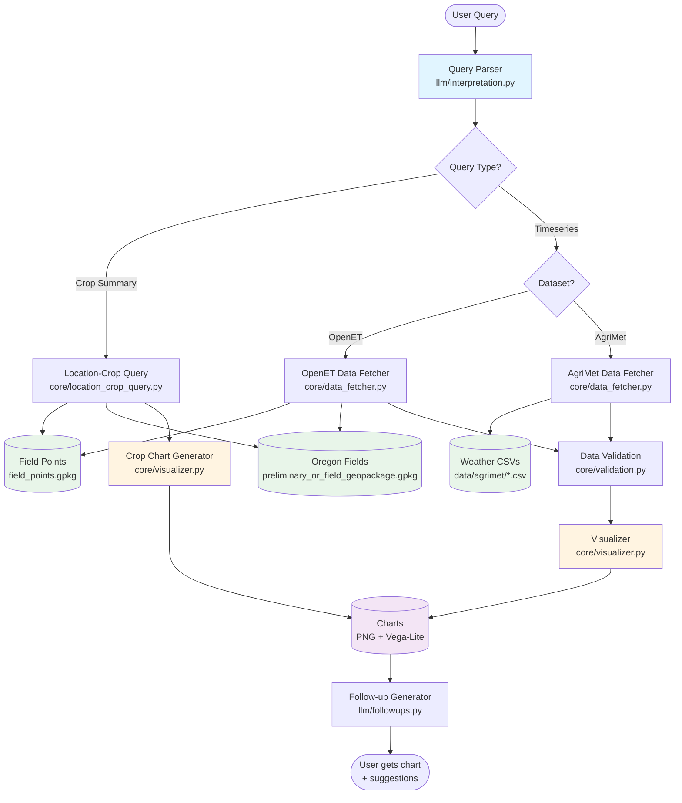

python smarttap.py "Show me water use for fields in Hood River from 2022 to 2024"

python smarttap.py "What is the irrigation water applied to spud fields in Hermiston?"

python smarttap.py "Show rainfall for lucerne fields in Klamath Falls for 2023"

python smarttap.py "What was the crop water consumption for cherry orchards in Hood River County?"

python smarttap.py "Show me water use for wheat in Hermiston from 2020 to 2024"

# SmartTap

**Natural language interface for querying and visualizing Oregon agricultural and weather data.**

Ask questions in plain English, get charts as answers using real Oregon agricultural and weather data.

---

## Quick Start

```bash
# 1. Ensure Ollama is running with Gemma
ollama pull gemma2:2b
ollama serve  # Keep running in separate terminal

# 2. Run a query
python smarttap.py "Show temperature in Corvallis for July 2024"

# 3. View your chart
open outputs/charts/chart_*_chart.png
```

---

## System Architecture



### Data Flow

1. **User Query** → Natural language question
2. **Query Parsing** → Parses query into structured JSON spec
3. **Routing** → Determines query type (crop summary vs. timeseries) and dataset (OpenET vs. AgriMet)
4. **Data Fetching** → Loads appropriate data from local files/databases
5. **Validation** → Checks data quality, generates quality report
6. **Visualization** → Creates PNG and Vega-Lite charts
7. **Follow-up Generation** → Suggests relevant next questions

---

## What You Can Ask

### Location-Based Queries

Query OpenET and AgriMet data by **city** or **county** across Oregon:

```bash
# OpenET field-level data (258,994 fields)
python smarttap.py "Show ETa in Corvallis from 2020 to 2022"
python smarttap.py "What's the precipitation in Benton County?"
python smarttap.py "Irrigation water for wheat fields in Hermiston"

# AgriMet weather stations (5 locations)
python smarttap.py "Show temperature in Hood River"
python smarttap.py "Daily precipitation in Klamath Falls"

# Crop queries
python smarttap.py "What crops are grown in Corvallis?"
python smarttap.py "Which crops are grown in Hood River County?"
```

**Coverage:**
- **258,994** agricultural fields across Oregon
- **620** cities
- **58** counties
- **102** crop types (alfalfa, wheat, cherries, etc.)

### Available Variables

| Dataset | Variables | Description |
|---------|-----------|-------------|
| **OpenET** | ETa, PPT, AW, P_rz, IRR_CU_VOLUME, WS_C, etc. | Field-level monthly aggregates |
| **AgriMet** | PC, SR, WS, OBM, MX, MN, TU | Daily weather station measurements |

**Full documentation:** [docs/UNIFIED_QUERY_GUIDE.md](docs/UNIFIED_QUERY_GUIDE.md)

---

## Key Features

- **Natural Language Queries** - Ask in plain English, no coding required  
- **Automatic Dataset Routing** - Smart selection between OpenET and AgriMet  
- **Location-Based Queries** - Query by city, county, or crop type  
- **Crop Filtering** - Filter results by crop (wheat, alfalfa, cherries, etc.)  
- **Multiple Chart Types** - Bar charts, pie charts, line plots, dual-axis, faceted  
- **Follow-up Suggestions** - Get smart suggestions for next questions  
- **Data Validation** - Automatic quality checks and reports  
- **Export Options** - PNG images and interactive Vega-Lite specs  

---

## Project Structure

```
SmartTap/
├── smarttap.py                          # Main entry point
├── core/                                # Core functionality
│   ├── data_fetcher.py                 # Load OpenET/AgriMet data
│   ├── location_crop_query.py          # Location-based crop queries
│   ├── visualizer.py                   # Chart generation
│   └── validation.py                   # Data quality checks
├── llm/                                 # Natural language processing
│   ├── interpretation.py               # Query parsing
│   ├── followups.py                    # Follow-up suggestions
│   └── config.py                       # Parser configuration
├── data/                                # Local data storage
│   ├── field_points.gpkg               # Field locations (67 MB)
│   ├── preliminary_or_field_geopackage.gpkg  # ET + crop data (23 GB)
│   ├── CDL_Crop_Codes_Oregon.csv       # Crop type lookup
│   ├── agrimet/                        # Weather CSVs (55 files)
│   └── archive/                        # Legacy/backup files
├── outputs/                             # Generated charts (auto-created)
│   ├── charts/                         # PNG and Vega-Lite files
│   └── validation/                     # Data quality reports
├── docs/                                # Documentation
│   ├── UNIFIED_QUERY_GUIDE.md          # Complete usage guide
│   ├── PRECIPITATION_ROUTING_GUIDE.md  # Dataset selection guide
│   ├── MODEL_EVALUATION.md             # Parser model comparison
│   ├── TESTING.md                      # Testing documentation
│   └── technical/                      # Developer documentation
├── scripts/                             # Setup/utility scripts
│   ├── fetch_agrimet_data.py           # Download weather data
│   ├── convert_openet_gpkg.py          # Convert GeoPackage to CSV
│   └── ...
└── tests/                               # Test suite
    ├── test_*.py                       # Unit and integration tests
    ├── run_tests.py                    # Test runner
    └── model_comparison.py             # Model evaluation
```

---

## Installation

### 1. Install Dependencies

```bash
# Python packages
pip install pandas geopandas matplotlib ollama

# Install Ollama (if not already installed)
# macOS/Linux: visit https://ollama.ai
# Then pull the model
ollama pull gemma2:2b
```

### 2. Run Ollama Server

```bash
ollama serve
# Keep this running in a separate terminal
```

### 3. Run a Query

```bash
python smarttap.py "Show temperature in Corvallis"
```

---

## How It Works

### 1. Query Parsing

Your question gets converted to structured JSON:

```
"Show irrigation water for wheat in Hood River"
↓
{
  "task": "visualize_timeseries",
  "dataset": "openet",
  "openet_geo": "location",
  "location": "Hood River",
  "location_type": "city",
  "crop_filter": "wheat",
  "variables": ["AW"],
  "start_date": "2024-01-01",
  "end_date": "2024-12-31"
}
```

### 2. Data Fetching

**For OpenET queries:**
1. Find fields near location (city/county)
2. Filter by crop type (optional)
3. Load monthly timeseries data
4. Aggregate across fields (mean/sum)

**For AgriMet queries:**
1. Map location to weather station
2. Load yearly CSV files
3. Filter by date range

### 3. Visualization

Smart chart selection:
- **1 variable** → Single-axis line chart
- **2 variables, similar scales** → Single-axis, multi-line
- **2 variables, different scales** → Dual-axis
- **3+ variables** → Faceted small multiples
- **Crop summary** → Horizontal bar

### 4. Follow-up Questions

The system analyzes your query and chart to suggest relevant next questions.

---

## Configuration

### Change Parser Model

```bash
# Use a different Ollama model
export SMARTTAP_MODEL="llama3.2:3b"
python smarttap.py "your query"

# Or edit llm/config.py
```

### Compare Models

```bash
# Test multiple models
python tests/model_comparison.py --quick

# See docs/MODEL_EVALUATION.md for details
```

---

## Data Sources

### 1. AgriMet Weather Stations
- **Source**: USBR AgriMet Network
- **Years**: 2015-2025
- **Locations**: Corvallis, Hood River, Klamath Falls, Ontario, Pendleton
- **Resolution**: Daily
- **Variables**: Temperature, precipitation, solar radiation, wind

### 2. OpenET + Crop Data
- **Source**: DRI/OWRD Oregon ET Study
- **Years**: 1985-2024
- **Coverage**: All of Oregon (258,994 fields)
- **Resolution**: Monthly
- **Variables**: ETa, PPT, irrigation, crop types, etc.

---

## Troubleshooting

### Connection Error
```bash
# Start Ollama server
ollama serve

# In a new terminal
ollama pull gemma2:2b
```

### Location Not Found
```
Location not available
   Available AgriMet stations: corvallis, hood river, klamath falls, ontario, pendleton
```

**Solution**: Try a different location, or use "field-level" to query OpenET data instead.

### No Data Found
- Check date ranges (OpenET: 1985-2024, AgriMet: 2015-2025)
- Verify location exists in Oregon
- See validation reports in `outputs/validation/`

---

## Testing

```bash
# Run full test suite
python tests/run_tests.py

# Individual tests
python tests/test_data_fetcher.py
python tests/test_llm_parsing.py

# Model comparison
python tests/model_comparison.py --quick
```

**See [docs/TESTING.md](docs/TESTING.md) for details**

---

## Documentation

- **[UNIFIED_QUERY_GUIDE.md](docs/UNIFIED_QUERY_GUIDE.md)** - Complete query reference
- **[PRECIPITATION_ROUTING_GUIDE.md](docs/PRECIPITATION_ROUTING_GUIDE.md)** - Dataset selection guide
- **[MODEL_EVALUATION.md](docs/MODEL_EVALUATION.md)** - Parser model comparison
- **[TESTING.md](docs/TESTING.md)** - Testing documentation

---

## Current Limitations

- **Precipitation ambiguity**: System defaults to OpenET for precipitation queries. Use "weather station precipitation" for AgriMet data or "field-level precipitation" for OpenET.
- **Single location per query**: Cannot compare multiple locations in one chart yet
- **Date formats**: Works best with explicit dates (e.g., "2020", "July 2024")
- **Crop queries**: Natural language crop queries generate charts, not text tables

---

## License

MIT License - See LICENSE file for details

---

## Contributing

Issues and PRs welcome! See existing code patterns in `core/` and `llm/` directories.

---

**Questions?** Check the [docs/](docs/) folder or open an issue.